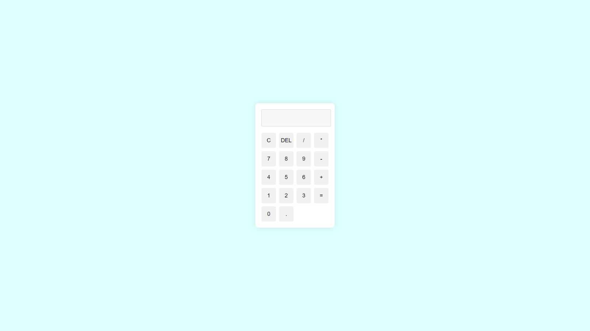

# Projeto pessoal: calculadora simples
Calculadora feita com HTML, CSS e JavaScript.

<h1 align="center">
  Calculadora simples
</h1>

  

## 📔 Conhecimentos abordados

1. HTML (Estrutura do Documento)

Elementos de formulário: O campo de texto (<input>) com o ID display é usado para mostrar os números e o resultado.
Botões: Os botões (<button>) são usados para interagir com a calculadora. Cada botão tem um valor e uma ação associada que é gerenciada pelo JavaScript.

2. CSS (Estilização)

Grid Layout: O layout dos botões é organizado usando CSS Grid, que facilita a distribuição uniforme dos elementos da interface.
Design Responsivo: O uso de width: 100% e o ajuste de font-size nos elementos permitem que a calculadora seja visualmente agradável em diferentes tamanhos de tela.
Transições: A propriedade transition é aplicada para criar uma leve mudança de cor quando os botões são clicados ou pairados, melhorando a experiência do usuário.

3. JavaScript (Interatividade)

Manipulação do DOM: Funções como document.getElementById() são usadas para acessar e modificar elementos no HTML, como o campo de exibição e os botões.
Funções:
appendToDisplay: Adiciona os números ou operadores ao visor conforme o usuário clica nos botões.
clearDisplay: Limpa o visor quando o botão "C" é clicado.
deleteLast: Remove o último caractere digitado no visor (função de "backspace").
calculateResult: Usa a função eval() para calcular a expressão no visor. Isso permite que a expressão digitada seja avaliada como uma operação matemática.

4. Tratamento de Erros

A função calculateResult usa um bloco try/catch para capturar erros ao tentar calcular expressões inválidas, exibindo "Erro" no visor caso algo dê errado.